# LMION — Door catalog

Status: **current door inventory reviewed, classified and fully specified for implementation**.

The inventory below covers the door-like openings currently present in the LMION deterministic Test Zone. It is the design reference for names, construction, durability, physical properties, pickup and replacement before implementation work is applied to the mod.

Preview images are the PNG assets stored in `LMION_Build/42/media/textures`.

## Conventions

- `Material`, `Material2` and `Material3` describe the engine-facing composition and may affect vanilla generic salvage.
- `MaterialType` is independent from `Material*` and is chosen for impact/material response.
- `DoorSound` defines the door-family open/close/final-break sound family.
- `ThumpSound` defines zombie impact sound when LMION intentionally overrides the engine fallback.
- `BuildBreakSound` / SpriteConfig `BreakSound` are deliberately out of scope.
- `World HP` is the durability of the existing world object. For multi-tile openings and paired doors, the displayed value is per segment / leaf.
- Pickup skill follows `floor(build level / 2)` unless the construction has no skill requirement.
- `Frame = paired` means the left/right entities form one paired double-door model; it is not a separate durability tier.
- Framed metal doors are removed from their hinges rather than cut out of the wall: pickup/replacement therefore use a Screwdriver, with a Crowbar added for heavier leaves. Blow Torch and Welding Mask are reserved for welded frameless structures.
- Welded frameless openings consume Welding Rods again on replacement. The replacement amount is approximately half the construction rod use, rounded up.
- Construction time scales with apparent work, size and complexity. XP scales primarily with required skill and recipe difficulty.

---

## Garage doors

All garage models share one gameplay family. Rolling, sectional and industrial appearances do not create different balance tiers; only solid versus glazed matters.

### Profiles

| Variant | Class | World HP / segment | Build skill | `health` | `skillBaseHealth` | HP at required level | HP lvl 10 | Materials | MaterialType | DoorSound | ThumpSound | Frame |
|---|---|---:|---|---:|---:|---:|---:|---|---|---|---|---|
| Solid | `metal` | 1200 | MetalWelding 6 | 600 | 400 | 3000 | 4600 | M1=MetalPlates; M2=MetalBars | Metal_Light | GarageDoor | ZombieThumpGarageDoor | none |
| Glazed | `metal_glazed` | 1000 | MetalWelding 6 | 500 | 350 | 2600 | 4000 | M1=MetalPlates; M2=MetalBars | Metal_Light | GarageDoor | ZombieThumpGarageDoor | none |

### Models

| Preview | Entity | EN name | FR name | Variant |
|---|---|---|---|---|
|  | `Base.IndustrialGarageDoor` | Industrial Garage Door | Porte de garage industrielle | Solid |
|  | `Base.GreenGarageDoor` | Green Garage Door | Porte de garage verte | Solid |
|  | `Base.WhiteGarageDoor` | White Garage Door | Porte de garage blanche | Solid |
|  | `Base.GreyGarageDoor` | Grey Garage Door | Porte de garage grise | Solid |
|  | `Base.RollingGarageDoor` | Rolling Garage Door | Porte de garage à enroulement | Solid |
|  | `Base.RedWindowGarageDoor` | Red Window Garage Door | Porte de garage rouge vitrée | Glazed |
|  | `Base.RollingWindowGarageDoor` | Rolling Window Garage Door | Porte de garage à enroulement vitrée | Glazed |

### Craft and handling

| Variant | Time | XP | Tools | Inputs | Pickup | Replacement |
|---|---:|---:|---|---|---|---|
| Solid | 200 | 50 | Welding Mask kept | Blow Torch 6 uses; Small Sheet Metal x9; Metal Bar x3; Door Hinge x6; Welding Rods 3 uses | MetalWelding 3; Blow Torch + Welding Mask; no break chance; 3 packages x 20 kg | all 3 packages + Blow Torch + Welding Mask; Welding Rods 2 uses |
| Glazed | 200 | 50 | Welding Mask kept | Blow Torch 6 uses; Small Sheet Metal x6; Glass Panel x3; Metal Bar x3; Door Hinge x6; Welding Rods 3 uses | MetalWelding 3; Blow Torch + Welding Mask; no break chance; 3 packages x 20 kg | all 3 packages + Blow Torch + Welding Mask; Welding Rods 2 uses |

---

## Portals and large gates

### Large wooden gates

The vanilla gate is the standard large wooden model. The LMION fence gate is the deliberately hardened, higher-skill counterpart.

#### Profiles

| Preview | Entity | EN name | FR name | Class | World HP / segment | Build skill | `health` | `skillBaseHealth` | HP at required level | HP lvl 10 | Materials | MaterialType | DoorSound | ThumpSound | Frame |
|---|---|---|---|---|---:|---|---:|---:|---:|---:|---|---|---|---|---|
|  | `Base.DoubleDoor` | Large Wooden Gate | Grand portail en bois | `wood` | 650 | Woodwork 4 | 400 | 300 | 1600 | 3400 | M1=Wood; M2=Nails | Wood_Solid | WoodGate | ZombieThumpWood | none |
| 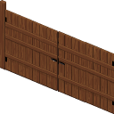 | `Base.LargeHardenedWoodenGate` | Large Hardened Wooden Gate | Grand portail en bois durci | `wood` | 750 | Woodwork 7 | 500 | 350 | 2950 | 4000 | M1=Wood; M2=Nails; M3=Screws | Wood_Solid | WoodGate | ZombieThumpWood | none |

#### Craft and handling

| Entity | Time | XP | Tools | Inputs | Pickup | Replacement |
|---|---:|---:|---|---|---|---|
| `Base.DoubleDoor` | 180 | 30 | Hammer kept | Plank x8; Nails x8; Door Hinge x4; Doorknob x2 | Woodwork 2; Hammer; no break chance; 2 packages x 18 kg | both packages + Hammer |
| `Base.LargeHardenedWoodenGate` | 240 | 60 | Hammer + Screwdriver kept | Plank x10; Nails x10; Screws x8; Door Hinge x4; Doorknob x2 | Woodwork 3; Hammer + Screwdriver; no break chance; 2 packages x 22 kg | both packages + Hammer + Screwdriver |

### Large metal gates

Three tiers are intentional: light farm barrier, regular cheap-metal gate, and wrought-iron heavy-duty gate. The chain-link and improvised scrap-metal models share the middle durability tier.

#### Profiles

| Preview | Entity | EN name | FR name | Tier | Class | World HP / segment | Build skill | `health` | `skillBaseHealth` | HP at required level | HP lvl 10 | Materials | MaterialType | DoorSound | ThumpSound | Frame |
|---|---|---|---|---|---|---:|---|---:|---:|---:|---:|---|---|---|---|---|
| 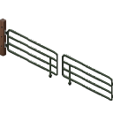 | `Base.LargeFarmGate` | Large Farm Gate | Grand portail de ferme | light farm | `metal` | 500 | MetalWelding 4 | 300 | 200 | 1100 | 2300 | M1=MetalPipe | Metal_Light | FarmGate | ZombieThumpMetalPoleGate | none |
|  | `Base.DoubleWireGate` | Large Chain-Link Gate | Grand portail grillagé | cheap metal | `metal` | 850 | MetalWelding 5 | 400 | 275 | 1775 | 3150 | M1=MetalPipe; M2=MetalWire | Metal_Light | MetalGate | ZombieThumpChainlinkFence | none |
|  | `Base.DoubleFenceGate` | Large Scrap Metal Gate | Grand portail en ferraille | cheap metal | `metal` | 850 | MetalWelding 5 | 400 | 275 | 1775 | 3150 | M1=MetalPipe; M2=MetalScrap | Metal_Light | MetalGate | ZombieThumpChainlinkFence | none |
| 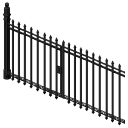 | `Base.LargeWroughtIronGate` | Large Wrought Iron Gate | Grand portail en fer forgé | wrought iron | `metal` | 1200 | MetalWelding 6 | 500 | 375 | 2750 | 4250 | M1=MetalBars; M2=MetalPipe | Metal_Solid | MetalPoleGateDouble | ZombieThumpMetalPoleGate | none |

#### Craft and handling

| Entity | Time | XP | Tools | Inputs | Pickup | Replacement |
|---|---:|---:|---|---|---|---|
| `Base.LargeFarmGate` | 160 | 30 | Welding Mask kept | Blow Torch 6 uses; Metal Pipe x8; Door Hinge x4; Welding Rods 4 uses | MetalWelding 2; Blow Torch + Welding Mask; no break chance; 2 packages x 12 kg | both packages + Blow Torch + Welding Mask; Welding Rods 2 uses |
| `Base.DoubleWireGate` | 220 | 40 | Welding Mask kept | Blow Torch 10 uses; Metal Pipe x8; Wire 4 uses; Door Hinge x4; Scrap Metal x2; Welding Rods 10 uses | MetalWelding 2; Blow Torch + Welding Mask; no break chance; 2 packages x 15 kg | both packages + Blow Torch + Welding Mask; Welding Rods 5 uses |
| `Base.DoubleFenceGate` | 240 | 40 | Welding Mask kept | Blow Torch 10 uses; Metal Pipe x10; Door Hinge x4; Scrap Metal x4; Welding Rods 10 uses | MetalWelding 2; Blow Torch + Welding Mask; no break chance; 2 packages x 20 kg | both packages + Blow Torch + Welding Mask; Welding Rods 5 uses |
| `Base.LargeWroughtIronGate` | 260 | 50 | Welding Mask kept | Blow Torch 8 uses; Metal Bar x8; Metal Pipe x4; Door Hinge x4; Welding Rods 6 uses | MetalWelding 3; Blow Torch + Welding Mask; no break chance; 2 packages x 30 kg | both packages + Blow Torch + Welding Mask; Welding Rods 3 uses |

---

## Fence gates

Naming hierarchy: **Large … Gate / Grand portail …** for double-width models, **… Gate / Portail …** for normal single-leaf models, and **Small … Gate / Portillon …** for the smallest models.

### Wooden fence gates

#### Profiles

| Preview | Entity | EN name | FR name | Class | World HP | Build skill | `health` | `skillBaseHealth` | HP at required level | HP lvl 10 | Materials | MaterialType | DoorSound | ThumpSound | Frame |
|---|---|---|---|---|---:|---|---:|---:|---:|---:|---|---|---|---|---|
|  | `Base.SmallWhiteWoodenGate` | Small White Wooden Gate | Portillon en bois blanc | `wood` | 425 | Woodwork 2 | 225 | 175 | 575 | 1975 | M1=Wood; M2=Nails | Wood | WoodGateSmall | ZombieThumpWood | none |
|  | `Base.WoodFenceGate` | Wooden Gate | Portail en bois | `wood` | 500 | Woodwork 3 | 300 | 225 | 975 | 2550 | M1=Wood; M2=Nails | Wood_Solid | WoodGate | ZombieThumpWood | none |
|  | `Base.HardenedWoodenGate` | Hardened Wooden Gate | Portail en bois durci | `wood` | 600 | Woodwork 5 | 400 | 275 | 1775 | 3150 | M1=Wood; M2=Nails; M3=Screws | Wood_Solid | WoodGate | ZombieThumpWood | none |

#### Craft and handling

| Entity | Time | XP | Tools | Inputs | Pickup | Replacement |
|---|---:|---:|---|---|---|---|
| `Base.SmallWhiteWoodenGate` | 60 | 10 | Hammer kept | Plank x2; Nails x2; Door Hinge x2 | Woodwork 1; Hammer; no break chance; 7 kg | package + Hammer |
| `Base.WoodFenceGate` | 100 | 15 | Hammer kept | Plank x4; Nails x4; Door Hinge x2; Doorknob x1 | Woodwork 1; Hammer; no break chance; 14 kg | package + Hammer |
| `Base.HardenedWoodenGate` | 150 | 30 | Hammer + Screwdriver kept | Plank x5; Nails x5; Screws x4; Door Hinge x2; Doorknob x1 | Woodwork 2; Hammer + Screwdriver; no break chance; 18 kg | package + Hammer + Screwdriver |

### Metal fence gates

At equal size, chain-link and rough scrap-metal gates share a durability tier. Wrought iron remains the strongest family.

#### Profiles

| Preview | Entity | EN name | FR name | Family / size | Class | World HP | Build skill | `health` | `skillBaseHealth` | HP at required level | HP lvl 10 | Materials | MaterialType | DoorSound | ThumpSound | Frame |
|---|---|---|---|---|---|---:|---|---:|---:|---:|---:|---|---|---|---|---|
|  | `Base.MetalWireFenceGateSmall` | Small Chain-Link Gate | Portillon grillagé | chain-link / small | `metal` | 450 | MetalWelding 2 | 250 | 175 | 600 | 2000 | M1=MetalPipe; M2=MetalWire | Metal_Light | MetalGate | ZombieThumpChainlinkFence | none |
|  | `Base.MetalWireFenceGate` | Chain-Link Gate | Portail grillagé | chain-link / normal | `metal` | 600 | MetalWelding 3 | 300 | 225 | 975 | 2550 | M1=MetalPipe; M2=MetalWire | Metal_Light | MetalGate | ZombieThumpChainlinkFence | none |
|  | `Base.MetalPoleFenceGateSmall` | Small Scrap Metal Gate | Portillon en ferraille | scrap / small | `metal` | 450 | MetalWelding 2 | 250 | 175 | 600 | 2000 | M1=MetalPipe; M2=MetalScrap | Metal_Light | MetalPoleGateSmall | ZombieThumpMetalPoleGate | none |
|  | `Base.MetalPoleFenceGate` | Scrap Metal Gate | Portail en ferraille | scrap / normal | `metal` | 600 | MetalWelding 3 | 300 | 225 | 975 | 2550 | M1=MetalPipe; M2=MetalScrap | Metal_Light | MetalPoleGate | ZombieThumpMetalPoleGate | none |
| 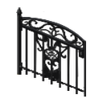 | `Base.SmallWroughtIronGate` | Small Wrought Iron Gate | Portillon en fer forgé | wrought iron / small | `metal` | 650 | MetalWelding 3 | 325 | 250 | 1075 | 2825 | M1=MetalBars; M2=MetalPipe | Metal_Solid | MetalPoleGateSmall | ZombieThumpMetalPoleGate | none |
| 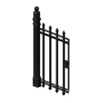 | `Base.WroughtIronGate` | Wrought Iron Gate | Portail en fer forgé | wrought iron / normal | `metal` | 850 | MetalWelding 4 | 400 | 300 | 1600 | 3400 | M1=MetalBars; M2=MetalPipe | Metal_Solid | MetalPoleGate | ZombieThumpMetalPoleGate | none |

#### Craft and handling

| Entity | Time | XP | Tools | Inputs | Pickup | Replacement |
|---|---:|---:|---|---|---|---|
| `Base.MetalWireFenceGateSmall` | 70 | 10 | Welding Mask kept | Blow Torch 2 uses; Metal Pipe x2; Wire 1 use; Door Hinge x2; Scrap Metal x1; Welding Rods 2 uses | MetalWelding 1; Blow Torch + Welding Mask; no break chance; 6 kg | package + Blow Torch + Welding Mask; Welding Rods 1 use |
| `Base.MetalWireFenceGate` | 110 | 15 | Welding Mask kept | Blow Torch 4 uses; Metal Pipe x4; Wire 2 uses; Door Hinge x2; Scrap Metal x1; Welding Rods 4 uses | MetalWelding 1; Blow Torch + Welding Mask; no break chance; 12 kg | package + Blow Torch + Welding Mask; Welding Rods 2 uses |
| `Base.MetalPoleFenceGateSmall` | 80 | 10 | Welding Mask kept | Blow Torch 3 uses; Metal Pipe x3; Door Hinge x2; Scrap Metal x1; Welding Rods 3 uses | MetalWelding 1; Blow Torch + Welding Mask; no break chance; 8 kg | package + Blow Torch + Welding Mask; Welding Rods 2 uses |
| `Base.MetalPoleFenceGate` | 120 | 15 | Welding Mask kept | Blow Torch 5 uses; Metal Pipe x5; Door Hinge x2; Scrap Metal x2; Welding Rods 5 uses | MetalWelding 1; Blow Torch + Welding Mask; no break chance; 16 kg | package + Blow Torch + Welding Mask; Welding Rods 3 uses |
| `Base.SmallWroughtIronGate` | 100 | 20 | Welding Mask kept | Blow Torch 3 uses; Metal Bar x2; Metal Pipe x1; Door Hinge x2; Welding Rods 2 uses | MetalWelding 1; Blow Torch + Welding Mask; no break chance; 12 kg | package + Blow Torch + Welding Mask; Welding Rods 1 use |
| `Base.WroughtIronGate` | 140 | 25 | Welding Mask kept | Blow Torch 5 uses; Metal Bar x4; Metal Pipe x2; Door Hinge x2; Welding Rods 4 uses | MetalWelding 2; Blow Torch + Welding Mask; no break chance; 25 kg | package + Blow Torch + Welding Mask; Welding Rods 2 uses |

---

## Restroom doors

### Stall doors

These five lightweight stall doors are cosmetic variants of one fragile profile. Their durability never scales with Woodwork.

#### Profiles

| Class | World HP | Build skill | `health` | `skillBaseHealth` | HP at required level | HP lvl 10 | Materials | MaterialType | DoorSound | ThumpSound | Frame |
|---|---:|---|---:|---:|---:|---:|---|---|---|---|---|
| `wood` | 150 | Woodwork 1 | 150 | 0 | 150 fixed | 150 | M1=Wood; M2=Screws | Wood | WoodDoor | ZombieThumpWood | standard |

#### Models

| Preview | Entity | EN name | FR name |
|---|---|---|---|
| 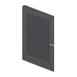 | `Base.BlackRestroomStallDoor` | Black Restroom Stall Door | Porte de cabine sanitaire noire |
|  | `Base.BlueRestroomStallDoor` | Blue Restroom Stall Door | Porte de cabine sanitaire bleue |
| 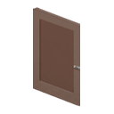 | `Base.BrownRestroomStallDoor` | Brown Restroom Stall Door | Porte de cabine sanitaire brune |
| 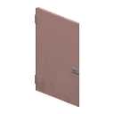 | `Base.PinkRestroomStallDoor` | Pink Restroom Stall Door | Porte de cabine sanitaire rose |
|  | `Base.WhiteRestroomStallDoor` | White Restroom Stall Door | Porte de cabine sanitaire blanche |

#### Craft and handling

| Time | XP | Tools | Inputs | Pickup | Replacement |
|---:|---:|---|---|---|---|
| 50 | 5 | Screwdriver kept | Plank x2; Screws x4; Door Hinge x2; no Doorknob | Woodwork 0; Screwdriver; no break chance; 8 kg | package + Screwdriver |

### Full-height restroom door

#### Profiles

| Preview | Entity | EN name | FR name | Class | World HP | Build skill | `health` | `skillBaseHealth` | HP at required level | HP lvl 10 | Materials | MaterialType | DoorSound | ThumpSound | Frame |
|---|---|---|---|---|---:|---|---:|---:|---:|---:|---|---|---|---|---|
|  | `Base.BlueRestroomDoor` | Blue Restroom Door | Porte de sanitaires bleue | `wood` | 200 | Woodwork 1 | 200 | 0 | 200 fixed | 200 | M1=Wood; M2=Screws | Plastic | MetalDoor | ZombieThumpGeneric | standard |

#### Craft and handling

| Time | XP | Tools | Inputs | Pickup | Replacement |
|---:|---:|---|---|---|---|
| 50 | 5 | Screwdriver kept | Plank x2; Screws x4; Door Hinge x2; no Doorknob | Woodwork 0; Screwdriver; no break chance; 10 kg | package + Screwdriver |

---

## Sliding glass doors

The brown and white models are the same wall-height sliding glass door with different frame finishes. Durability is fixed and does not scale with skill.

### Profiles

| Class | World HP | Build skill | `health` | `skillBaseHealth` | HP at required level | HP lvl 10 | Materials | MaterialType | DoorSound | ThumpSound | Frame |
|---|---:|---|---:|---:|---:|---:|---|---|---|---|---|
| `glass` | 250 | MetalWelding 3 | 250 | 0 | 250 fixed | 250 | M1=MetalPlates; M2=MetalBars; M3=Glass | Glass_Solid | SlidingGlassDoor | ZombieThumpWindow | none |

### Models

| Preview | Entity | EN name | FR name |
|---|---|---|---|
|  | `Base.BrownSlidingGlassDoor` | Brown Sliding Glass Door | Porte coulissante vitrée brune |
|  | `Base.WhiteSlidingGlassDoor` | White Sliding Glass Door | Porte coulissante vitrée blanche |

### Craft and handling

| Time | XP | Tools | Inputs | Pickup | Replacement |
|---:|---:|---|---|---|---|
| 100 | 15 | Welding Mask kept | Blow Torch 4 uses; Small Sheet Metal x2; Metal Bar x2; Glass Panel x2; Welding Rods 4 uses | MetalWelding 1; Crowbar; no break chance; 20 kg | package + Blow Torch + Welding Mask; Welding Rods 2 uses |

---

## Wooden 1x1 doors

### Solid wooden doors

The normal solid-wood progression is based on workmanship: basic, standard, then artisan. Rough and rustic variants reuse those tiers rather than creating new ones. The outhouse door is a separate fixed-durability utility model.

#### Profiles

| Entity | EN name | FR name | Tier | Class | World HP | Build skill | `health` | `skillBaseHealth` | HP at required level | HP lvl 10 | Materials | MaterialType | DoorSound | ThumpSound | Frame |
|---|---|---|---|---|---:|---|---:|---:|---:|---:|---|---|---|---|---|
| `Base.WoodenDoorLvl1` | Basic Wooden Door | Porte en bois basique | basic | `wood` | 400 | Woodwork 3 | 250 | 150 | 700 | 1750 | M1=Wood; M2=Nails | Wood_Solid | WoodDoor | ZombieThumpWood | standard |
| `Base.RoughWoodenDoor` | Rough Wooden Door | Porte en bois brut | basic | `wood` | 400 | Woodwork 3 | 250 | 150 | 700 | 1750 | M1=Wood; M2=Nails | Wood_Solid | WoodDoor | ZombieThumpWood | standard |
| `Base.WoodenDoorLvl2` | Sturdy Wooden Door | Porte en bois robuste | standard | `wood` | 500 | Woodwork 5 | 300 | 200 | 1300 | 2300 | M1=Wood; M2=Nails | Wood_Solid | WoodDoor | ZombieThumpWood | standard |
| `Base.RusticWoodenDoor` | Rustic Wooden Door | Porte en bois rustique | standard | `wood` | 500 | Woodwork 5 | 300 | 200 | 1300 | 2300 | M1=Wood; M2=Nails | Wood_Solid | WoodDoor | ZombieThumpWood | standard |
| `Base.WoodenDoorLvl3` | Artisan Wooden Door | Porte en bois artisanale | artisan | `wood` | 600 | Woodwork 7 | 350 | 250 | 2100 | 2850 | M1=Wood; M2=Nails | Wood_Solid | WoodDoor | ZombieThumpWood | standard |
| `Base.OuthouseDoor` | Outhouse Door | Porte de latrines | utility | `wood` | 250 | Woodwork 1 | 250 | 0 | 250 fixed | 250 | M1=Wood; M2=Nails | Wood | WoodDoor | ZombieThumpWood | standard |

#### Craft and handling

| Entity | Time | XP | Tools | Inputs | Pickup | Replacement |
|---|---:|---:|---|---|---|---|
| `Base.WoodenDoorLvl1` | 90 | 15 | Hammer kept | Plank x4; Nails x4; Door Hinge x2; Doorknob x1 | Woodwork 1; Hammer; no break chance; 15 kg | package + Hammer |
| `Base.RoughWoodenDoor` | 90 | 15 | Hammer kept | Plank x4; Nails x4; Door Hinge x2; Doorknob x1 | Woodwork 1; Hammer; no break chance; 14 kg | package + Hammer |
| `Base.WoodenDoorLvl2` | 120 | 25 | Hammer kept | Plank x4; Nails x4; Door Hinge x2; Doorknob x1 | Woodwork 2; Hammer; no break chance; 15 kg | package + Hammer |
| `Base.RusticWoodenDoor` | 120 | 25 | Hammer kept | Plank x4; Nails x4; Door Hinge x2; Doorknob x1 | Woodwork 2; Hammer; no break chance; 15 kg | package + Hammer |
| `Base.WoodenDoorLvl3` | 160 | 40 | Hammer kept | Plank x4; Nails x4; Door Hinge x2; Doorknob x1 | Woodwork 3; Hammer; no break chance; 15 kg | package + Hammer |
| `Base.OuthouseDoor` | 50 | 5 | Hammer kept | Plank x3; Nails x4; Door Hinge x2; Doorknob x1 | Woodwork 0; Hammer; no break chance; 10 kg | package + Hammer |

### Paneled wooden doors

These four models are the same high-quality four-panel household door with different finishes.

#### Profiles

| Preview | Entity | EN name | FR name | Class | World HP | Build skill | `health` | `skillBaseHealth` | HP at required level | HP lvl 10 | Materials | MaterialType | DoorSound | ThumpSound | Frame |
|---|---|---|---|---|---:|---|---:|---:|---:|---:|---|---|---|---|---|
| 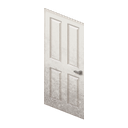 | `Base.WhitePanelDoor` | White Panel Door | Porte blanche à panneaux | `wood` | 625 | Woodwork 6 | 450 | 275 | 2100 | 3200 | M1=Wood; M2=Nails; M3=Screws | Wood_Solid | WoodDoor | ZombieThumpWood | standard |
|  | `Base.BrownPanelDoor` | Brown Panel Door | Porte brune à panneaux | `wood` | 625 | Woodwork 6 | 450 | 275 | 2100 | 3200 | M1=Wood; M2=Nails; M3=Screws | Wood_Solid | WoodDoor | ZombieThumpWood | standard |
|  | `Base.MahoganyPanelDoor` | Mahogany Panel Door | Porte acajou à panneaux | `wood` | 625 | Woodwork 6 | 450 | 275 | 2100 | 3200 | M1=Wood; M2=Nails; M3=Screws | Wood_Solid | WoodDoor | ZombieThumpWood | standard |
| 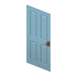 | `Base.BluePanelDoor` | Blue Panel Door | Porte bleue à panneaux | `wood` | 625 | Woodwork 6 | 450 | 275 | 2100 | 3200 | M1=Wood; M2=Nails; M3=Screws | Wood_Solid | WoodDoor | ZombieThumpWood | standard |

#### Craft and handling

| Time | XP | Tools | Inputs | Pickup | Replacement |
|---:|---:|---|---|---|---|
| 150 | 35 | Hammer + Screwdriver kept | Plank x4; Nails x4; Door Hinge x2; Screws x4; Doorknob x1 | Woodwork 3; Hammer + Screwdriver; no break chance; 17 kg | package + Hammer + Screwdriver |

### Wooden doors with one window

The white and brown models are residential one-window doors. The blue Pile O' Crepe model is a slightly stronger commercial version. A single window does **not** switch zombie impacts to the window family.

#### Profiles

| Preview | Entity | EN name | FR name | Role | Class | World HP | Build skill | `health` | `skillBaseHealth` | HP at required level | HP lvl 10 | Materials | MaterialType | DoorSound | ThumpSound | Frame |
|---|---|---|---|---|---|---:|---|---:|---:|---:|---:|---|---|---|---|---|
|  | `Base.WhiteDoorWithWindows` | White Door with Windows | Porte blanche avec fenêtres | residential | `wood_glazed` | 550 | Woodwork 6 | 400 | 250 | 1900 | 2900 | M1=Wood; M2=Nails; M3=Screws | Wood_Solid | WoodDoor | ZombieThumpWood | standard |
|  | `Base.BrownDoorWithWindows` | Brown Door with Windows | Porte brune avec fenêtres | residential | `wood_glazed` | 550 | Woodwork 6 | 400 | 250 | 1900 | 2900 | M1=Wood; M2=Nails; M3=Screws | Wood_Solid | WoodDoor | ZombieThumpWood | standard |
|  | `Base.BlueDoorWithWindow` | Blue Door with Window | Porte bleue vitrée | commercial | `wood_glazed` | 575 | Woodwork 7 | 425 | 250 | 2175 | 2925 | M1=Wood; M2=Nails; M3=Screws | Wood_Solid | MetalDoor | ZombieThumpWood | standard |

#### Craft and handling

| Variant | Time | XP | Tools | Inputs | Pickup | Replacement |
|---|---:|---:|---|---|---|---|
| Residential | 160 | 35 | Hammer + Screwdriver kept | Plank x4; Nails x4; Door Hinge x2; Screws x4; Doorknob x1; Glass Panel x1 | Woodwork 3; Hammer + Screwdriver; no break chance; 16 kg | package + Hammer + Screwdriver |
| Commercial blue | 180 | 45 | Hammer + Screwdriver kept | Plank x4; Nails x4; Door Hinge x2; Screws x4; Doorknob x1; Glass Panel x1 | Woodwork 3; Hammer + Screwdriver; no break chance; 17 kg | package + Hammer + Screwdriver |

### Wooden two-pane doors

These five commercial-style doors share one profile. Branding and color are cosmetic only.

#### Profiles

| Preview | Entity | EN name | FR name | Class | World HP | Build skill | `health` | `skillBaseHealth` | HP at required level | HP lvl 10 | Materials | MaterialType | DoorSound | ThumpSound | Frame |
|---|---|---|---|---|---:|---|---:|---:|---:|---:|---|---|---|---|---|
|  | `Base.RedTwoPaneDoor` | Red Two-Pane Door | Porte rouge à deux vitres | `wood_glazed` | 500 | Woodwork 7 | 350 | 225 | 1925 | 2600 | M1=Wood; M2=Nails; M3=Screws | Wood_Solid | MetalDoor | ZombieThumpWindow | standard |
|  | `Base.BlueTwoPaneDoor` | Blue Two-Pane Door | Porte bleue à deux vitres | `wood_glazed` | 500 | Woodwork 7 | 350 | 225 | 1925 | 2600 | M1=Wood; M2=Nails; M3=Screws | Wood_Solid | MetalDoor | ZombieThumpWindow | standard |
| 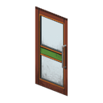 | `Base.GreenStripedTwoPaneDoor` | Green-Striped Two-Pane Door | Porte à deux vitres à bande verte | `wood_glazed` | 500 | Woodwork 7 | 350 | 225 | 1925 | 2600 | M1=Wood; M2=Nails; M3=Screws | Wood_Solid | MetalDoor | ZombieThumpWindow | standard |
|  | `Base.BrownTwoPaneDoor` | Brown Two-Pane Door | Porte brune à deux vitres | `wood_glazed` | 500 | Woodwork 7 | 350 | 225 | 1925 | 2600 | M1=Wood; M2=Nails; M3=Screws | Wood_Solid | MetalDoor | ZombieThumpWindow | standard |
| 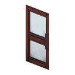 | `Base.DarkBrownTwoPaneDoor` | Dark Brown Two-Pane Door | Porte brun foncé à deux vitres | `wood_glazed` | 500 | Woodwork 7 | 350 | 225 | 1925 | 2600 | M1=Wood; M2=Nails; M3=Screws | Wood_Solid | MetalDoor | ZombieThumpWindow | standard |

#### Craft and handling

| Time | XP | Tools | Inputs | Pickup | Replacement |
|---:|---:|---|---|---|---|
| 180 | 45 | Hammer + Screwdriver kept | Plank x4; Nails x4; Door Hinge x2; Screws x4; Doorknob x1; Glass Panel x2 | Woodwork 3; Hammer + Screwdriver; no break chance; 16 kg | package + Hammer + Screwdriver |

### Wooden full-glass doors

These are wooden-framed doors dominated by one large glass panel and form the weakest normal-quality glazed wooden tier.

#### Profiles

| Preview | Entity | EN name | FR name | Class | World HP | Build skill | `health` | `skillBaseHealth` | HP at required level | HP lvl 10 | Materials | MaterialType | DoorSound | ThumpSound | Frame |
|---|---|---|---|---|---:|---|---:|---:|---:|---:|---|---|---|---|---|
| 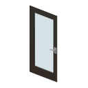 | `Base.BlackFullGlassDoor` | Black Full-Glass Door | Porte noire entièrement vitrée | `wood_glazed` | 425 | Woodwork 7 | 300 | 175 | 1525 | 2050 | M1=Wood; M2=Nails; M3=Screws | Glass_Solid | MetalDoor | ZombieThumpWindow | standard |
| 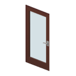 | `Base.BrownFullGlassDoor` | Brown Full-Glass Door | Porte brune entièrement vitrée | `wood_glazed` | 425 | Woodwork 7 | 300 | 175 | 1525 | 2050 | M1=Wood; M2=Nails; M3=Screws | Glass_Solid | MetalDoor | ZombieThumpWindow | standard |

#### Craft and handling

| Time | XP | Tools | Inputs | Pickup | Replacement |
|---:|---:|---|---|---|---|
| 170 | 40 | Hammer + Screwdriver kept | Plank x2; Nails x2; Door Hinge x2; Screws x4; Doorknob x1; Glass Panel x3 | Woodwork 3; Hammer + Screwdriver; no break chance; 14 kg | package + Hammer + Screwdriver |

---

## Metal 1x1 doors

### Basic and finished metal doors

The progression separates the rough patchwork vanilla door, the cleaner second vanilla tier, and the finished metal variants. One-window finished doors remain metal-impact doors.

#### Profiles

| Preview | Entity | EN name | FR name | Tier | Class | World HP | Build skill | `health` | `skillBaseHealth` | HP at required level | HP lvl 10 | Materials | MaterialType | DoorSound | ThumpSound | Frame |
|---|---|---|---|---|---|---:|---|---:|---:|---:|---:|---|---|---|---|---|
|  | `Base.MetalDoorLvl1` | Basic Metal Door | Porte en métal basique | patchwork | `metal` | 650 | MetalWelding 3 | 350 | 250 | 1100 | 2850 | M1=MetalPlates; M2=MetalScrap | Metal_Light | MetalDoor | ZombieThumpMetal | standard |
|  | `Base.MetalDoorLvl2` | Simple Metal Door | Porte en métal simple | simple | `metal` | 750 | MetalWelding 4 | 400 | 275 | 1500 | 3150 | M1=MetalPlates | Metal_Light | MetalDoor | ZombieThumpMetal | standard |
|  | `Base.WhiteMetalDoor` | White Metal Door | Porte métallique blanche | finished solid | `metal` | 800 | MetalWelding 4 | 425 | 275 | 1525 | 3175 | M1=MetalPlates; M2=MetalBars | Metal_Solid | MetalDoor | ZombieThumpMetal | standard |
|  | `Base.TanMetalDoor` | Tan Metal Door | Porte métallique beige | finished solid | `metal` | 800 | MetalWelding 4 | 425 | 275 | 1525 | 3175 | M1=MetalPlates; M2=MetalBars | Metal_Solid | MetalDoor | ZombieThumpMetal | standard |
| 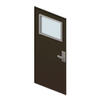 | `Base.BlackMetalDoorWithWindow` | Black Metal Door with Window | Porte métallique noire vitrée | finished one-window | `metal_glazed` | 700 | MetalWelding 4 | 375 | 225 | 1275 | 2625 | M1=MetalPlates; M2=MetalBars | Metal_Solid | MetalDoor | ZombieThumpMetal | standard |
| 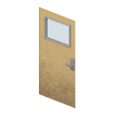 | `Base.TanMetalDoorWithWindow` | Tan Metal Door with Window | Porte métallique beige vitrée | finished one-window | `metal_glazed` | 700 | MetalWelding 4 | 375 | 225 | 1275 | 2625 | M1=MetalPlates; M2=MetalBars | Metal_Solid | MetalDoor | ZombieThumpMetal | standard |

#### Craft and handling

| Variant | Time | XP | Tools | Inputs | Pickup | Replacement |
|---|---:|---:|---|---|---|---|
| Patchwork (`MetalDoorLvl1`) | 120 | 20 | Welding Mask kept | Blow Torch 4 uses; Small Sheet Metal x3; Door Hinge x2; Welding Rods 4 uses; Doorknob x1 | MetalWelding 1; Screwdriver; no break chance; 20 kg | package + Screwdriver |
| Simple (`MetalDoorLvl2`) | 140 | 25 | Welding Mask kept | Blow Torch 4 uses; Small Sheet Metal x3; Door Hinge x2; Welding Rods 4 uses; Doorknob x1 | MetalWelding 2; Screwdriver + Crowbar; no break chance; 22 kg | package + Screwdriver |
| Finished solid | 160 | 30 | Welding Mask kept | Blow Torch 4 uses; Sheet Metal x1; Metal Bar x2; Door Hinge x2; Welding Rods 4 uses; Doorknob x1 | MetalWelding 2; Screwdriver + Crowbar; no break chance; 24 kg | package + Screwdriver |
| Finished one-window | 170 | 30 | Welding Mask kept | Blow Torch 4 uses; Sheet Metal x1; Metal Bar x2; Door Hinge x2; Welding Rods 4 uses; Doorknob x1; Glass Panel x1 | MetalWelding 2; Screwdriver + Crowbar; no break chance; 22 kg | package + Screwdriver |

### Metal two-pane door

#### Profiles

| Preview | Entity | EN name | FR name | Class | World HP | Build skill | `health` | `skillBaseHealth` | HP at required level | HP lvl 10 | Materials | MaterialType | DoorSound | ThumpSound | Frame |
|---|---|---|---|---|---:|---|---:|---:|---:|---:|---|---|---|---|---|
|  | `Base.BlackTwoPaneMetalDoor` | Black Two-Pane Metal Door | Porte métallique noire à deux vitres | `metal_glazed` | 650 | MetalWelding 5 | 350 | **225** | **1475** | **2600** | M1=MetalPlates; M2=MetalBars | Metal_Solid | MetalDoor | ZombieThumpWindow | standard |

#### Craft and handling

| Time | XP | Tools | Inputs | Pickup | Replacement |
|---:|---:|---|---|---|---|
| 190 | 35 | Welding Mask kept | Blow Torch 4 uses; Sheet Metal x1; Metal Bar x2; Door Hinge x2; Welding Rods 4 uses; Doorknob x1; Glass Panel x2 | MetalWelding 2; Screwdriver + Crowbar; no break chance; 21 kg | package + Screwdriver |

### Metal service doors

These are light swing/service doors used as separation rather than intrusion-resistant construction. Their wooden internal frame is clad with sheet metal and screwed hardware; no welding equipment or separate doorknob is used in their construction.

#### Profiles

| Preview | Entity | EN name | FR name | Variant | Class | World HP | Build skill | `health` | `skillBaseHealth` | HP at required level | HP lvl 10 | Materials | MaterialType | DoorSound | ThumpSound | Frame |
|---|---|---|---|---|---|---:|---|---:|---:|---:|---:|---|---|---|---|---|
|  | `Base.BlueServiceDoor` | Blue Service Door | Porte de service bleue | solid | `metal` | 700 | MetalWelding 3 | 375 | 250 | 1125 | 2875 | M1=MetalPlates; M2=Wood; M3=Screws | Metal_Light | MetalDoor | ZombieThumpMetal | standard |
| 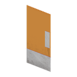 | `Base.OrangeServiceDoor` | Orange Service Door | Porte de service orange | solid | `metal` | 700 | MetalWelding 3 | 375 | 250 | 1125 | 2875 | M1=MetalPlates; M2=Wood; M3=Screws | Metal_Light | MetalDoor | ZombieThumpMetal | standard |
| 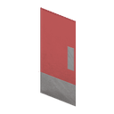 | `Base.LightRedServiceDoor` | Light Red Service Door | Porte de service rouge clair | solid | `metal` | 700 | MetalWelding 3 | 375 | 250 | 1125 | 2875 | M1=MetalPlates; M2=Wood; M3=Screws | Metal_Light | MetalDoor | ZombieThumpMetal | standard |
| 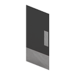 | `Base.BlackServiceDoor` | Black Service Door | Porte de service noire | solid | `metal` | 700 | MetalWelding 3 | 375 | 250 | 1125 | 2875 | M1=MetalPlates; M2=Wood; M3=Screws | Metal_Light | MetalDoor | ZombieThumpMetal | standard |
| 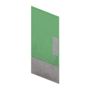 | `Base.GreenServiceDoor` | Green Service Door | Porte de service verte | solid | `metal` | 700 | MetalWelding 3 | 375 | 250 | 1125 | 2875 | M1=MetalPlates; M2=Wood; M3=Screws | Metal_Light | MetalDoor | ZombieThumpMetal | standard |
| 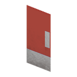 | `Base.RedServiceDoor` | Red Service Door | Porte de service rouge | solid | `metal` | 700 | MetalWelding 3 | 375 | 250 | 1125 | 2875 | M1=MetalPlates; M2=Wood; M3=Screws | Metal_Light | MetalDoor | ZombieThumpMetal | standard |
|  | `Base.WhiteServiceDoorWithPorthole` | White Service Door with Porthole | Porte de service blanche à hublot | porthole | `metal_glazed` | 650 | MetalWelding 3 | 325 | 225 | 1000 | 2575 | M1=MetalPlates; M2=Wood; M3=Screws | Metal_Light | MetalDoor | ZombieThumpMetal | standard |

#### Craft and handling

| Variant | Time | XP | Tools | Inputs | Pickup | Replacement |
|---|---:|---:|---|---|---|---|
| Solid | 120 | 15 | Screwdriver kept | Sheet Metal x1; Small Sheet Metal x1; Plank x2; Screws x6; Door Hinge x2; no Doorknob | MetalWelding 1; Screwdriver + Crowbar; no break chance; 18 kg | package + Screwdriver |
| Porthole | 120 | 15 | Screwdriver kept | Sheet Metal x1; Small Sheet Metal x1; Plank x2; Screws x6; Door Hinge x2; Glass Panel x1; no Doorknob | MetalWelding 1; Screwdriver + Crowbar; no break chance; 17 kg | package + Screwdriver |

---

## Special doors

These models deliberately sit outside the normal family progression.

### Profiles

| Preview | Entity | EN name | FR name | Class | World HP | Build skill | `health` | `skillBaseHealth` | HP at required level | HP lvl 10 | Materials | MaterialType | DoorSound | ThumpSound | Frame |
|---|---|---|---|---|---:|---|---:|---:|---:|---:|---|---|---|---|---|
|  | `Base.LogDoor` | Log Door | Porte en rondins | `heavy_wood` | 700 | Woodwork 0 | 700 | 0 | 700 fixed | 700 | M1=Log | Wood_Solid | WoodDoor | ZombieThumpWood | standard |
|  | `Base.JailDoor` | Jail Door | Porte de cellule | `jail` | 2000 | MetalWelding 10 | 1000 | 500 | 6000 | 6000 | M1=MetalBars; M2=MetalPlates; M3=Screws | Metal_Solid | PrisonMetalDoor | ZombieThumpMetal | standard |
|  | `Base.SecurityDoor` | Security Door | Porte sécurisée | `security` | 3000 | MetalWelding 10 | 1250 | 650 | 7750 | 7750 | M1=MetalBars; M2=MetalPlates; M3=MetalWire | Metal_Solid | MetalDoor | ZombieThumpMetal | standard |

### Craft and handling

| Entity | Time | XP | Tools | Inputs | Pickup | Replacement |
|---|---:|---:|---|---|---|---|
| `Base.LogDoor` | 80 | 5 | none | Log x4; Ripped Sheets x4 | Woodwork 0; no tools; no break chance; 25 kg | package; no tools |
| `Base.JailDoor` | 300 | 75 | Welding Mask + Screwdriver kept | Blow Torch 10 uses; Steel Bar x7; Small Steel Sheet x2; Door Hinge x4; Screws x8; Doorknob x1; Welding Rods 8 uses | MetalWelding 5; Screwdriver + Crowbar; no break chance; 30 kg | package + Screwdriver |
| `Base.SecurityDoor` | 400 | 100 | Welding Mask + Screwdriver kept | Blow Torch 12 uses; Steel Bar x6; Sheet Metal x2; Glass Panel x2; Wire x4; Door Hinge x4; Screws x8; Doorknob x1; Electronics Scrap x2; Electric Wire x2; Welding Rods 10 uses | MetalWelding 5; Screwdriver + Crowbar; no break chance; 35 kg | package + Screwdriver |

For the Security Door, `Glass Panel x2 + Wire x4` is the temporary reinforced-glass solution and should become Armored Glass x2 if that component is added later.

---

## Paired double doors

Paired doors introduce no new balance tier. Each leaf inherits the reviewed single-door profile that matches its construction. Only the paired geometry and left/right entity split are specific to this section. Craft, pickup and package weight are **per leaf**.

### Profiles

| Preview | Entities | EN name | FR name | Class | World HP / leaf | Build skill | `health` | `skillBaseHealth` | HP at required level | HP lvl 10 | Materials | MaterialType | DoorSound | ThumpSound | Frame |
|---|---|---|---|---|---:|---|---:|---:|---:|---:|---|---|---|---|---|
|  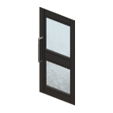 | `Base.BlackTwoPaneDoubleDoorLeft` `Base.BlackTwoPaneDoubleDoorRight` | Black Two-Pane Double Door | Double porte noire à deux vitres | `metal_glazed` | 650 | MetalWelding 5 | 350 | 225 | 1475 | 2600 | M1=MetalPlates; M2=MetalBars | Metal_Solid | MetalDoor | ZombieThumpWindow | paired |
|   | `Base.GreyMetalDoubleDoorLeft` `Base.GreyMetalDoubleDoorRight` | Grey Metal Double Door | Double porte métallique grise | `metal` | 800 | MetalWelding 4 | 425 | 275 | 1525 | 3175 | M1=MetalPlates; M2=MetalBars | Metal_Solid | MetalDoor | ZombieThumpMetal | paired |
| 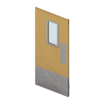  | `Base.YellowServiceDoubleDoorLeft` `Base.YellowServiceDoubleDoorRight` | Yellow Service Double Door | Double porte de service jaune | `metal_glazed` | 650 | MetalWelding 3 | 325 | 225 | 1000 | 2575 | M1=MetalPlates; M2=Wood; M3=Screws | Metal_Light | MetalDoor | ZombieThumpMetal | paired |
|   | `Base.BlueChurchDoubleDoorLeft` `Base.BlueChurchDoubleDoorRight` | Blue Church Double Door | Double porte d'église bleue | `wood` | 625 | Woodwork 6 | 450 | 275 | 2100 | 3200 | M1=Wood; M2=Nails; M3=Screws | Wood_Solid | WoodDoor | ZombieThumpWood | paired |
|   | `Base.BrownChurchDoubleDoorLeft` `Base.BrownChurchDoubleDoorRight` | Brown Church Double Door | Double porte d'église brune | `wood` | 625 | Woodwork 6 | 450 | 275 | 2100 | 3200 | M1=Wood; M2=Nails; M3=Screws | Wood_Solid | WoodDoor | ZombieThumpWood | paired |

### Craft and handling

| Model | Time | XP | Tools | Inputs per leaf | Pickup per leaf | Replacement per leaf |
|---|---:|---:|---|---|---|---|
| Black two-pane | 190 | 35 | Welding Mask kept | Blow Torch 4 uses; Sheet Metal x1; Metal Bar x2; Door Hinge x2; Welding Rods 4 uses; Doorknob x1; Glass Panel x2 | MetalWelding 2; Screwdriver + Crowbar; no break chance; 21 kg | package + Screwdriver |
| Grey metal | 160 | 30 | Welding Mask kept | Blow Torch 4 uses; Sheet Metal x1; Metal Bar x2; Door Hinge x2; Welding Rods 4 uses; Doorknob x1 | MetalWelding 2; Screwdriver + Crowbar; no break chance; 24 kg | package + Screwdriver |
| Yellow service | 120 | 15 | Screwdriver kept | Sheet Metal x1; Small Sheet Metal x1; Plank x2; Screws x6; Door Hinge x2; Glass Panel x1; no Doorknob | MetalWelding 1; Screwdriver + Crowbar; no break chance; 17 kg | package + Screwdriver |
| Blue church | 150 | 35 | Hammer + Screwdriver kept | Plank x4; Nails x4; Door Hinge x2; Screws x4; Doorknob x1 | Woodwork 3; Hammer + Screwdriver; no break chance; 17 kg | package + Hammer + Screwdriver |
| Brown church | 150 | 35 | Hammer + Screwdriver kept | Plank x4; Nails x4; Door Hinge x2; Screws x4; Doorknob x1 | Woodwork 3; Hammer + Screwdriver; no break chance; 17 kg | package + Hammer + Screwdriver |

---

## Catalog coverage

All door-like openings currently identified in the LMION Test Zone have been visually reviewed and assigned to a gameplay family. The catalog no longer contains unresolved design `TBD` values; later changes should be balance revisions driven by implementation or in-game testing rather than missing specification.
