# LMION — Door catalog

Status: working catalog for profile preparation. Values marked with `?` are provisional inferences that must be checked against the actual vanilla TileDef/runtime data before they are pushed into LMION profiles.

The inventory below is based on the openings currently present in the LMION deterministic Test Zone. The goal is to prepare names, physical classes, durability baselines, materials, sounds, pickup and construction data in one place before profiles are generated in bulk.

The preview images are the PNG assets already stored in `LMION_Build/42/media/textures`. Raw HTML `` tags are used because Markdown tables otherwise display the source PNGs at their natural size.

## Durability baselines

These are provisional gameplay baselines, not final balance. For multi-tile openings the value applies to each segment. Group destruction remains a separate rule: a garage segment reaching zero destroys the full garage door, while a portal segment reaching zero destroys the affected leaf/side.

| Durability class | Baseline HP / segment | Intent |
|---|---:|---|
| `wood` | 500 | reference solid wooden opening |
| `wood_glazed` | 425 | wooden opening weakened by glazing |
| `heavy_wood` | 600 | heavy/log timber; still below normal metal |
| `metal` | 650 | reference solid metal opening |
| `metal_glazed` | 550 | metal opening weakened by glazing |
| `glass` | 350 | mostly-glass opening |
| `jail` | 1000 | reinforced prison exception |
| `security` | 1200 | reinforced security exception |
| `unknown` | TBD | material/structure must be checked before assigning HP |

Construction skill bonuses are a separate system. These baselines are the proposed logical world-door durability reference, not a replacement for Build's skill-derived health formula.

## Material and sound fields

The catalog deliberately leaves engine property values blank until they are checked against real supported values. This avoids repeating the `TilePropertyAliasMap` corruption problem caused by writing arbitrary strings.

Fields to fill after verification:

- `Material`, `Material2`, `Material3`;
- `MaterialType`;
- `DoorSound` for `IsoDoor` open/close/lock/break behavior;
- `BreakSound` for construction/`IsoThumpable` paths where relevant;
- pickup weight/tool/skill;
- craft components and craft skills.

## Garage doors

| Preview | Model / entity | EN name | FR name | Class | HP | Glazed | Frame | Material(s) | MaterialType | DoorSound | BreakSound |
|---|---|---|---|---|---:|---|---|---|---|---|---|
| 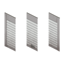 | `Base.IndustrialGarageDoor` | Industrial Garage Door | Porte de garage industrielle | `metal` | 1200 | no | none | M1=MetalPlates; M2=MetalBars | Metal_Large | GarageDoor | TBD |
| 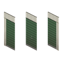 | `Base.GreenGarageDoor` | Green Garage Door | Porte de garage verte | `metal` | 1200 | no | none | M1=MetalPlates; M2=MetalBars | Metal_Large | GarageDoor | TBD |
| 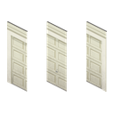 | `Base.WhiteGarageDoor` | White Garage Door | Porte de garage blanche | `metal` | 1200 | no | none | M1=MetalPlates; M2=MetalBars | Metal_Large | GarageDoor | TBD |
| 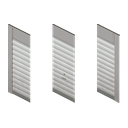 | `Base.GreyGarageDoor` | Grey Garage Door | Porte de garage grise | `metal` | 1200 | no | none | M1=MetalPlates; M2=MetalBars | Metal_Large | GarageDoor | TBD |
| 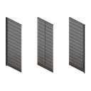 | `Base.RollingGarageDoor` | Rolling Garage Door | Porte de garage à enroulement | `metal` | 1200 | no | none | M1=MetalPlates; M2=MetalBars | Metal_Large | GarageDoor | TBD |
| 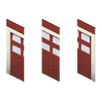 | `Base.RedWindowGarageDoor` | Red Window Garage Door | Porte de garage rouge vitrée | `metal_glazed` | 1000 | yes | none | M1=MetalPlates; M2=MetalBars | Metal_Large | GarageDoor | TBD |
| 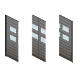 | `Base.RollingWindowGarageDoor` | Rolling Window Garage Door | Porte de garage à enroulement vitrée | `metal_glazed` | 1000 | yes | none | M1=MetalPlates; M2=MetalBars | Metal_Large | GarageDoor | TBD |

## Portals and large gates

| Preview | Model / entity | EN name | FR name | Class | HP / segment | Glazed | Frame | Material(s) | MaterialType | DoorSound | BreakSound |
|---|---|---|---|---|---:|---|---|---|---|---|---|
| 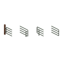 | `Base.FarmDoubleGate` | Farm Double Gate | Double portail de ferme | `wood` | 800 | no | none | M1=MetalPipe | Metal_Light | MetalPoleGateDouble | TBD |
| 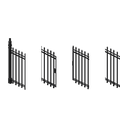 | `Base.WroughtIronDoubleGate` | Wrought Iron Double Gate | Double portail en fer forgé | `metal` | 1200 | no | none | M1=MetalBars | Metal_Solid | MetalPoleGateDouble | TBD |
| 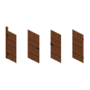 | `Base.WoodenFenceDoubleGate` | Wooden Fence Double Gate | Double portail de clôture en bois | `wood` | 600 | no | none | M1=Wood; M2=Nails | Wood_Solid | WoodDoor | TBD |
|  | `Base.DoubleWireGate` | Double Wire Gate | Double portail grillagé | `metal` | 650 | no | none | M1=MetalPipe; M2=MetalWire | Metal_Light | MetalGate | TBD |
|  | `Base.DoubleFenceGate` | Double Fence Gate | Double portail de clôture | `unknown` | TBD | no | none | TBD | TBD | TBD | TBD |
|  | `Base.DoubleDoor` | Double Door | Double porte | `wood?` | 500 | no | none | TBD | TBD | TBD | TBD |

## Paired double doors

Left/right entities are listed together because they represent one visual door model for naming/material/balance purposes. Runtime placement/grouping may still require distinct entity handling.

| Preview | Model / entities | EN name | FR name | Class | HP / segment | Glazed | Frame | Material(s) | MaterialType | DoorSound | BreakSound |
|---|---|---|---|---|---:|---|---|---|---|---|---|
| 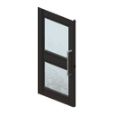 | `Base.BlackGlassDoubleDoorLeft` / `Right` | Black Glass Double Door | Double porte vitrée noire | `glass?` | 350 | yes | paired | TBD | TBD | TBD | TBD |
| 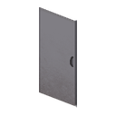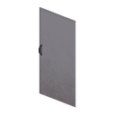 | `Base.GreyMetalDoubleDoorLeft` / `Right` | Grey Metal Double Door | Double porte métallique grise | `metal` | 650 | no | paired | TBD | TBD | TBD | TBD |
| 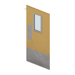 | `Base.YellowMetalDoubleDoorLeft` / `Right` | Yellow Metal Double Door | Double porte métallique jaune | `metal` | 650 | no | paired | TBD | TBD | TBD | TBD |
| 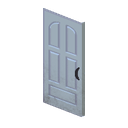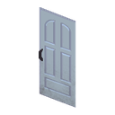 | `Base.BlueChurchDoubleDoorLeft` / `Right` | Blue Church Double Door | Double porte d'église bleue | `wood?` | 500 | no | paired | TBD | TBD | TBD | TBD |
| 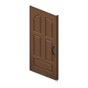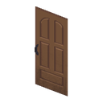 | `Base.BrownChurchDoubleDoorLeft` / `Right` | Brown Church Double Door | Double porte d'église brune | `wood?` | 500 | no | paired | TBD | TBD | TBD | TBD |

## Single gates, fence gates and wickets

These stay separate from normal 1x1 doors because their material, pickup, placement and later repair rules may need to differ even when the runtime object is still an `IsoDoor`.

| Preview | Entity | EN name | FR name | Class | HP | Frame | Material(s) | MaterialType | DoorSound | BreakSound |
|---|---|---|---|---|---:|---|---|---|---|---|
|  | `Base.MetalWireFenceGate` | Metal Wire Fence Gate | Portail de clôture grillagée | `metal` | 650 | none | TBD | TBD | TBD | TBD |
|  | `Base.MetalWireFenceGateSmall` | Small Metal Wire Fence Gate | Petit portail de clôture grillagée | `metal` | 650 | none | TBD | TBD | TBD | TBD |
|  | `Base.MetalPoleFenceGate` | Metal Pole Fence Gate | Portail de clôture métallique | `metal` | 650 | none | TBD | TBD | TBD | TBD |
|  | `Base.MetalPoleFenceGateSmall` | Small Metal Pole Fence Gate | Petit portail de clôture métallique | `metal` | 650 | none | TBD | TBD | TBD | TBD |
|  | `Base.WoodFenceGate` | Wood Fence Gate | Portail de clôture en bois | `wood` | 500 | none | TBD | TBD | TBD | TBD |
|  | `Base.SmallMetalFenceGate` | Small Metal Fence Gate | Petit portail métallique | `metal` | 650 | none | TBD | TBD | TBD | TBD |
| 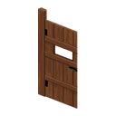 | `Base.TallWoodenFenceGate` | Tall Wooden Fence Gate | Grand portail de clôture en bois | `wood` | 500 | none | TBD | TBD | TBD | TBD |
|  | `Base.TallWroughtIronGate` | Tall Wrought Iron Gate | Grand portail en fer forgé | `metal` | 650 | none | TBD | TBD | TBD | TBD |
| 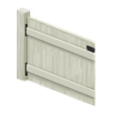 | `Base.SmallWhiteWoodenFenceGate` | Small White Wooden Fence Gate | Petit portail de clôture en bois blanc | `wood` | 500 | none | TBD | TBD | TBD | TBD |

## Simple 1x1 doors

| Preview | Entity | EN name | FR name | Class | HP | Glazed | Frame | Material(s) | MaterialType | DoorSound | BreakSound |
|---|---|---|---|---|---:|---|---|---|---|---|---|
|  | `Base.WoodenDoorLvl1` | Wooden Door Level 1 | Porte en bois niveau 1 | `wood` | 500 | no | standard | TBD | TBD | TBD | TBD |
|  | `Base.WoodenDoorLvl2` | Wooden Door Level 2 | Porte en bois niveau 2 | `wood` | 500 | no | standard | TBD | TBD | TBD | TBD |
|  | `Base.WoodenDoorLvl3` | Wooden Door Level 3 | Porte en bois niveau 3 | `wood` | 500 | no | standard | TBD | TBD | TBD | TBD |
|  | `Base.WhiteWoodenDoor` | White Wooden Door | Porte en bois blanche | `wood` | 500 | no | standard | TBD | TBD | TBD | TBD |
|  | `Base.MetalDoorLvl2` | Metal Door Level 2 | Porte métallique niveau 2 | `metal` | 650 | no | standard | TBD | TBD | TBD | TBD |
|  | `Base.MetalDoorLvl1` | Metal Door Level 1 | Porte métallique niveau 1 | `metal` | 650 | no | standard | TBD | TBD | TBD | TBD |
| 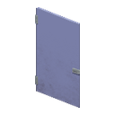 | `Base.SmallBlueDoor` | Small Blue Door | Petite porte bleue | `unknown` | TBD | no | standard | TBD | TBD | TBD | TBD |
|  | `Base.SmallPinkDoor` | Small Pink Door | Petite porte rose | `unknown` | TBD | no | standard | TBD | TBD | TBD | TBD |
| 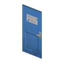 | `Base.BlueRestroomDoor` | Blue Restroom Door | Porte de sanitaires bleue | `unknown` | TBD | no | standard | TBD | TBD | TBD | TBD |
| 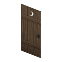 | `Base.OuthouseDoor` | Outhouse Door | Porte de latrines | `wood?` | 500 | no | standard | TBD | TBD | TBD | TBD |
| 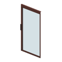 | `Base.BrownSlidingGlassDoor` | Brown Sliding Glass Door | Porte coulissante vitrée brune | `glass?` | 350 | yes | none | TBD | TBD | TBD | TBD |
| 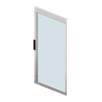 | `Base.WhiteSlidingGlassDoor` | White Sliding Glass Door | Porte coulissante vitrée blanche | `glass?` | 350 | yes | none | TBD | TBD | TBD | TBD |
| 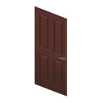 | `Base.CherryDoor` | Cherry Door | Porte en cerisier | `wood` | 500 | no | standard | current canary; final TBD | `Wood_Solid` currently | TBD | current script TBD |
|  | `Base.TanDoorWithWindow` | Tan Door with Window | Porte beige avec fenêtre | `wood_glazed?` | 425 | yes | standard | TBD | TBD | TBD | TBD |
|  | `Base.BlackDoorWithWindow` | Black Door with Window | Porte noire avec fenêtre | `wood_glazed?` | 425 | yes | standard | TBD | TBD | TBD | TBD |
| 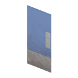 | `Base.BlueMetalDoor` | Blue Metal Door | Porte métallique bleue | `metal` | 650 | no | standard | vanilla observed `MetalPlates` + `Door`; LMION final TBD | vanilla observed `Plastic`; LMION final TBD | TBD | TBD |
| 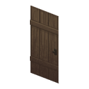 | `Base.RoughWoodenDoor` | Rough Wooden Door | Porte en bois brut | `wood` | 500 | no | standard | TBD | TBD | TBD | TBD |
| 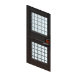 | `Base.SecurityDoor` | Security Door | Porte sécurisée | `security` | 3000 | no | standard | M1=MetalBars; M2=MetalPlates | TBD | MetalDoor | TBD |
|  | `Base.ChestnutGlassDoor` | Chestnut Glass Door | Porte vitrée châtaigne | `glass?` | 350 | yes | standard | TBD | TBD | TBD | TBD |
|  | `Base.BlackGlassDoor` | Black Glass Door | Porte vitrée noire | `glass?` | 350 | yes | standard | TBD | TBD | TBD | TBD |
| 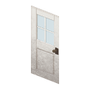 | `Base.WhiteDoorWithWindows` | White Door with Windows | Porte blanche avec fenêtres | `wood_glazed?` | 425 | yes | standard | TBD | TBD | TBD | TBD |
| 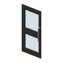 | `Base.BlackTwoPaneDoor` | Black Two-Pane Door | Porte noire à deux vitres | `wood_glazed?` | 425 | yes | standard | TBD | TBD | TBD | TBD |
| 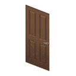 | `Base.BrownDoor` | Brown Door | Porte brune | `unknown` | TBD | no | standard | TBD | TBD | TBD | TBD |
| 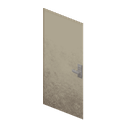 | `Base.WhiteMetalDoor` | White Metal Door | Porte métallique blanche | `metal` | 650 | no | standard | TBD | TBD | TBD | TBD |
| 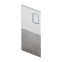 | `Base.WhiteMetalDoorWithWindow` | White Metal Door with Window | Porte métallique blanche vitrée | `metal_glazed` | 550 | yes | standard | TBD | TBD | TBD | TBD |
| 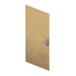 | `Base.TanMetalDoor` | Tan Metal Door | Porte métallique beige | `metal` | 650 | no | standard | TBD | TBD | TBD | TBD |
|  | `Base.WoodenDoor` | Wooden Door | Porte en bois | `wood` | 500 | no | standard | TBD | TBD | TBD | TBD |
|  | `Base.BlueDoor` | Blue Door | Porte bleue | `unknown` | TBD | no | standard | TBD | TBD | TBD | TBD |
|  | `Base.BlackMetalDoor` | Black Metal Door | Porte métallique noire | `metal` | 650 | no | standard | TBD | TBD | TBD | TBD |
|  | `Base.SmallBrownPanelDoor` | Small Brown Panel Door | Petite porte à panneau brune | `unknown` | TBD | no | standard | TBD | TBD | TBD | TBD |
| 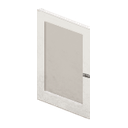 | `Base.SmallWhitePanelDoor` | Small White Panel Door | Petite porte à panneau blanche | `unknown` | TBD | no | standard | TBD | TBD | TBD | TBD |
|  | `Base.SmallBlackPanelDoor` | Small Black Panel Door | Petite porte à panneau noire | `unknown` | TBD | no | standard | TBD | TBD | TBD | TBD |
| 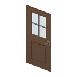 | `Base.BrownDoorWithWindows` | Brown Door with Windows | Porte brune avec fenêtres | `wood_glazed?` | 425 | yes | standard | TBD | TBD | TBD | TBD |
|  | `Base.RedMetalDoor` | Red Metal Door | Porte métallique rouge | `metal` | 650 | no | standard | TBD | TBD | TBD | TBD |
| 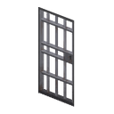 | `Base.JailDoor` | Jail Door | Porte de prison | `jail` | 2000 | no | standard | M1=MetalBars | Metal_Solid | PrisonMetalDoor | TBD |
| 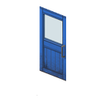 | `Base.PileOCrepeBlueDoorWithWindow` | Pile O' Crepe Blue Door with Window | Porte bleue vitrée Pile O' Crepe | `wood_glazed?` | 425 | yes | standard | TBD | TBD | TBD | TBD |
|  | `Base.PileOCrepeOrangeDoor` | Pile O' Crepe Orange Door | Porte orange Pile O' Crepe | `unknown` | TBD | no | standard | TBD | TBD | TBD | TBD |
| 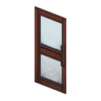 | `Base.PizzaWhirledBrownGlassDoor` | Pizza Whirled Brown Glass Door | Porte vitrée brune Pizza Whirled | `glass?` | 350 | yes | standard | TBD | TBD | TBD | TBD |
|  | `Base.PizzaWhirledGreenMetalDoor` | Pizza Whirled Green Metal Door | Porte métallique verte Pizza Whirled | `metal` | 650 | no | standard | TBD | TBD | TBD | TBD |
|  | `Base.SeaHorseGlassDoor` | Sea Horse Glass Door | Porte vitrée Sea Horse | `glass?` | 350 | yes | standard | TBD | TBD | TBD | TBD |
|  | `Base.SpiffosGlassDoor` | Spiffo's Glass Door | Porte vitrée Spiffo's | `glass?` | 350 | yes | standard | TBD | TBD | TBD | TBD |
|  | `Base.SpiffosRedMetalDoor` | Spiffo's Red Metal Door | Porte métallique rouge Spiffo's | `metal` | 650 | no | standard | TBD | TBD | TBD | TBD |
| 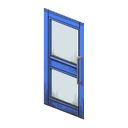 | `Base.FossoilDoor` | Fossoil Door | Porte Fossoil | `unknown` | TBD | no | standard | TBD | TBD | TBD | TBD |
| 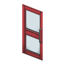 | `Base.Gas2GoDoor` | Gas2Go Door | Porte Gas2Go | `unknown` | TBD | no | standard | TBD | TBD | TBD | TBD |
| 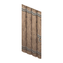 | `Base.LogDoor` | Log Door | Porte en rondins | `heavy_wood` | 600 | no | standard | M1=Log | Wood_Solid | WoodDoor | TBD |

## Current known exceptions and validated facts

- `CherryDoor` localized names are already runtime-validated: `Cherry Door` / `Porte en cerisier`.
- Cherry's current `MetalPlates` secondary material is a diagnostic canary and must not be copied into the final catalog profile.
- `BlueMetalDoor` was runtime-observed with `Material = MetalPlates`, `Material2 = Door`, `MaterialType = Plastic`; these are vanilla/world facts, not automatically the intended LMION final values.
- `BlueMetalDoor` currently uses `worldMaxHealth = 600` only as a runtime durability canary. The catalog proposes the normal metal baseline of 650 for later balance application.
- `LogDoor` vanilla TileDef was observed with `Material = Log` and `MaterialType = Wood_Solid`; `Log` is not one of the exact salvage tags already verified in `IsoObject.addItemsFromProperties()`, so its final LMION material setup still needs a deliberate decision.
- Jail and Security doors deliberately override normal material-class durability.
- Single fence gates/wickets are kept separate from normal 1x1 doors even if they share `IsoDoor`, so their gameplay profile can diverge later without reclassifying the catalog.

## Next pass

The next pass should fill the engine-facing physical fields model by model from verified source/runtime data, starting with the unambiguous classes and the reference doors:

1. `CherryDoor`;
2. `LogDoor`;
3. `BlueMetalDoor`;
4. `JailDoor`;
5. `SecurityDoor`;
6. one full-glass door;
7. one glazed wood door;
8. one single fence gate;
9. one garage door and one windowed garage door.

Once these establish the valid `Material*`, `MaterialType`, `DoorSound` and `BreakSound` patterns, those patterns can be propagated to the rest of the catalog and reviewed before LMION profiles are generated in bulk.
